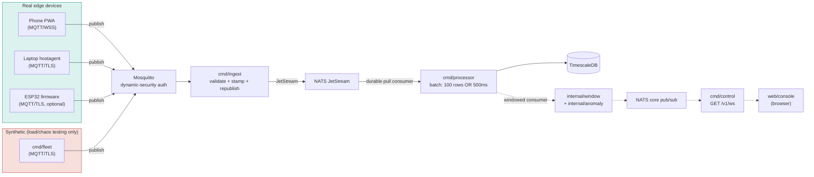

# SenseGrid

[](https://github.com/Ritesh956/SenseGrid/actions/workflows/ci.yml)
[](go.mod)
[](docs/phase10-report.md)

A real-time IoT telemetry and control platform, built phase-by-phase from a bare repo to a
production-hardened stack: real sensor data from a phone PWA, a laptop agent, and (optionally) ESP32
firmware flows through **MQTT → NATS JetStream → TimescaleDB**, with a control plane that provisions
devices, pushes config back down to them, runs staged rollouts, and detects anomalies in real time.

Every claim in this README is backed by evidence gathered against a live stack, not asserted — see
[`docs/phase10-report.md`](docs/phase10-report.md) for the numbers.

## What makes this different from a toy IoT demo

- **Real edge devices, not just simulators.** A phone running the PWA and a laptop running
  `cmd/hostagent` publish genuine `DeviceMotionEvent`/CPU/battery/WiFi readings. Synthetic load
  (`cmd/fleet`) exists solely for load and chaos testing — it's never part of the primary data path.
- **A synthetic 1000-device fleet found the real saturation point**: flat latency through 200 devices,
  a sharp onset at 400–600, implicating a specific bottleneck resource (the single-instance ingest
  bridge) — not asserted, measured and explained.
- **Chaos-tested for real**: broker restart, processor SIGKILL, database pause, and network partition
  drills all run live against the stack — broker restart recovers 100/100 devices in ~11s, DB pause
  recovers with zero duplicate rows (idempotency guard verified under redelivery), full results in
  [`docs/phase10-report.md`](docs/phase10-report.md).
- **A measured backup/restore RTO of 121s** against a real 1.3M-row dataset, 92.8% storage saved by
  compression (lossless, verified), and a real rate-limiter starvation bug found and fixed with
  before/after numbers — [`docs/phase8-hardening-report.md`](docs/phase8-hardening-report.md).
- **Zero unaddressed CRITICAL vulnerabilities** across every built image (govulncheck + npm audit +
  Trivy), including a real CVE fix in the console's auth library.
- **Bugs found along the way are documented, not hidden** — a null-slice-vs-`[]` JSON API bug, an MQTT
  client ordering bug that let one device starve nineteen others, a test-harness measurement bug that
  produced a bogus "43,736 messages lost" reading off stale reused state. Each one: root cause,
  measured impact, fix, confirmed after. See `CLAUDE.md` for the full trail.

## Architecture



Full per-hop latency budget (backed by a live Jaeger trace, not just design constants) in
[`docs/phase10-report.md`](docs/phase10-report.md).

## Quickstart

```bash
git clone https://github.com/Ritesh956/SenseGrid.git
cd SenseGrid
cp .env.example .env
bash scripts/gen-certs.sh
docker compose -f deploy/docker-compose.yml --env-file .env up -d --build
```

Then:
- **Console**: `https://localhost:8090` (accept the dev CA warning once), console UI at
  `http://localhost:3100` — provision a login with
  `docker compose -f deploy/docker-compose.yml --env-file .env exec control /app user create -username admin -role admin -password <password>`.
- **Grafana**: `http://localhost:3300` (admin/admin) — dashboards + SLO alerts provisioned as code.
- **Jaeger**: `http://localhost:16686` — traces joined end-to-end by `trace_id`, device to console.
- **Prometheus**: `http://localhost:9190/targets`.

To send real telemetry: open the PWA served at `https://localhost:8090/` on a phone on the same LAN
(needs one TLS-exception click, see below), or run the host agent natively:

```bash
export MSYS_NO_PATHCONV=1
docker compose -f deploy/docker-compose.yml --env-file .env exec control \
  /app token create -name my-device -type laptop -ttl 1h
HOSTAGENT_CLAIM_TOKEN=<token> TLS_CA_FILE=deploy/certs/ca.pem go run ./cmd/hostagent
```

Full command reference, Windows/Git Bash gotchas, and the auth model are in
[`CLAUDE.md`](CLAUDE.md).

## Tech stack

Go (ingest/processor/control/fleet/hostagent) · Next.js + TypeScript (console) · Mosquitto
(dynamic-security, no anonymous access) · NATS JetStream (streams + KV) · TimescaleDB (hypertables,
continuous aggregates, compression/retention) · Redis (tokens) · OpenTelemetry → Jaeger · Prometheus +
Grafana · Docker Compose · GitHub Actions.

## Project layout

```
cmd/            5 Go services: ingest, processor, control, fleet, hostagent
internal/       shared packages: config, telemetry, shadow, rules, anomaly, alerts, rollout, dynsec, ...
web/console/    Next.js operator console (Phase 5)
web/sensor-client/  hand-rolled MQTT-over-WS PWA (Phase 1, no MQTT.js dependency)
firmware/esp32/ Arduino/PlatformIO ESP32 firmware speaking the same v1 wire contract (Phase 9)
deploy/         docker-compose, Dockerfiles, migrations, certs, Grafana/Prometheus provisioning
test/chaos/     load ramp + 4 chaos drills (broker/processor/DB/partition) + chart renderer
test/hardening/ backup/restore, compression/retention, rate-limiter drills
docs/           phase10-report.md, phase8-hardening-report.md, runbook.md
```

## Status

All 11 phases (0–10) shipped and tagged — `v0.1-phase0` through `v1.0-phase10`. See
[`CLAUDE.md`](CLAUDE.md)'s phase table for what each phase actually delivered, with evidence links.
The full original 11-phase plan (targets, data contracts, testing strategy, risk register, timeline)
is published as the **SenseGrid Blueprint**, linked from `CLAUDE.md`.

## Documentation

- [`CLAUDE.md`](CLAUDE.md) — architecture, auth model, data contracts, phase-by-phase build log
- [`docs/phase10-report.md`](docs/phase10-report.md) — the submission report: latency budget, scaling
  curve, failure-recovery table, design decisions, honest scope statement
- [`docs/phase8-hardening-report.md`](docs/phase8-hardening-report.md) — backup/restore RTO,
  compression/retention, rate-limiter bug, vulnerability scan
- [`docs/runbook.md`](docs/runbook.md) — one-page on-call runbook
- [`test/chaos/README.md`](test/chaos/README.md) · [`firmware/esp32/README.md`](firmware/esp32/README.md)
