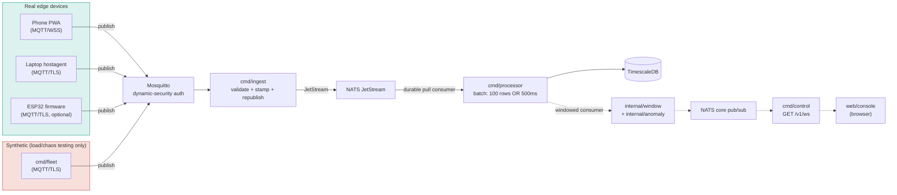

# SenseGrid

[](https://github.com/Ritesh956/SenseGrid/actions/workflows/ci.yml)
[](go.mod)
[](docs/phase10-report.md)

A real-time IoT telemetry and control platform, built phase-by-phase from a bare repo to a
production-hardened stack: real sensor data from a phone PWA, a laptop agent, and (optionally) ESP32
firmware flows through **MQTT → NATS JetStream → TimescaleDB**, with a control plane that provisions
devices, pushes config back down to them, runs staged rollouts, and detects anomalies in real time.

Every claim in this README is backed by evidence gathered against a live stack, not asserted — see
[`docs/phase10-report.md`](docs/phase10-report.md) for the numbers.

## Contents

- [The problem this solves](#the-problem-this-solves)
- [Why this architecture — the reasoning, not just the diagram](#why-this-architecture--the-reasoning-not-just-the-diagram)
- [How it works](#how-it-works)
  - [1. Provisioning and identity](#1-provisioning-and-identity--how-a-device-gets-trusted)
  - [2. The telemetry path](#2-the-telemetry-path--device-to-database)
  - [3. Device shadow — pushing config back down](#3-device-shadow--pushing-config-back-down)
  - [4. Stream processing and anomaly detection](#4-stream-processing-and-anomaly-detection)
  - [5. Staged rollouts and auto-rollback](#5-staged-rollouts-and-auto-rollback)
  - [6. Observability — following one reading end to end](#6-observability--following-one-reading-end-to-end)
- [What makes this different from a toy IoT demo](#what-makes-this-different-from-a-toy-iot-demo)
- [Architecture diagram](#architecture-diagram)
- [Quickstart](#quickstart)
- [Tech stack](#tech-stack)
- [Project layout](#project-layout)
- [Status](#status)
- [Documentation](#documentation)

## The problem this solves

Most IoT demos stop at "a device sends a number, a dashboard shows a number." That's not what makes a
telemetry platform hard. The real problems start once you have devices you don't fully control (phones
that sleep, laptops on flaky WiFi, sensors in the field), a data pipeline that has to survive its own
components failing, and an operator who needs to *act* on what the data says — not just look at it.
SenseGrid is built around four of those real problems:

1. **Untrusted, intermittent edges.** A phone or a field sensor isn't a server — it goes offline, its
   clock drifts, and it shouldn't be able to see or spoof any other device's data. The system has to
   authenticate every device individually, tolerate reconnects as the normal case rather than the
   exception, and never let one misbehaving device degrade everyone else's stream (see the rate-limiter
   bug in [Design decision: why per-device rate limiting](#4-stream-processing-and-anomaly-detection)
   below for exactly this failure mode, found and fixed live).
2. **"Is this reading bad, or did we just enter winter?"** A single threshold on a raw value is either
   too sensitive (fires on every gust of wind) or too blind (misses a slow drift). Real anomaly
   detection needs a rolling statistical baseline *per device, per sensor* — which means state, not just
   a rule.
3. **Pushing config to devices you can't SSH into.** Changing a fleet's sample rate, or which sensors
   are active, has to work for a device that's offline right now and won't be back for an hour — without
   the control plane polling every device to check.
4. **Proving the system survives failure, not assuming it does.** Every "the system is resilient"
   trades on evidence: numbers from actually restarting the broker mid-stream, actually killing the
   database, and actually measuring what data lands (or doesn't). This repo's evidence is in
   [`docs/phase10-report.md`](docs/phase10-report.md).

That combination — trustless edges, statistical anomaly detection, durable async config delivery, and
adversarially-tested resilience — is what SenseGrid is a working example of, using a phone, a laptop,
and (optionally) a $5 microcontroller as the real devices, not a simulator pretending to be one.

## Why this architecture — the reasoning, not just the diagram

Every non-obvious choice below was a real decision with a real alternative on the table, not the only
option that existed:

- **MQTT for the edge, not HTTP polling.** Devices publish once and don't wait for a response; the
  broker handles fan-in from however many devices are connected. A device that's asleep for ten minutes
  just... reconnects and resumes — there's no "missed poll" state to reconcile, because nothing was
  polling it. HTTP would need the device to be reachable, which a phone behind NAT/carrier-grade
  networking usually isn't.
- **A pub/sub broker with real per-device auth, not shared credentials.** Mosquitto's
  `dynamic-security` plugin gives every claimed device its own identity, pinned so it can only publish
  to its own topic (`%c` ACL substitution) — a compromised or malfunctioning device can't read or spoof
  another device's stream. Three other identities (`bridge`, `control`, `admin`) exist for services that
  legitimately need cross-device access, each scoped narrowly to what it actually does. Full table in
  [How it works §1](#1-provisioning-and-identity--how-a-device-gets-trusted).
- **NATS JetStream over Kafka for the durable stream.** The stack already needs lightweight pub/sub for
  control-plane fan-out (alerts, rollout events, the console's live feed) — JetStream adds durable,
  replayable streaming *and* a KV bucket (used for device shadow state, below) as features of the same
  server process, instead of standing up Kafka's multi-JVM, ZooKeeper-dependent footprint for a project
  meant to run on one machine. One dependency covering three needs beat three separate systems.
- **TimescaleDB over vanilla Postgres or a dedicated time-series DB.** It's Postgres — the same SQL,
  the same tooling, the same `pg_dump`/`pg_restore` backup story (measured at a 121s RTO against a real
  1.3M-row dataset) — with hypertables, continuous aggregates, and native compression (92.8% storage
  saved, verified lossless) layered on top. No new query language, no separate operational surface.
- **Retained MQTT publish for config, not a REST push.** A device that's offline right now still needs
  to get its config the moment it reconnects, without the control plane polling "is it back yet?" — a
  retained publish means the broker hands a reconnecting device its last-known desired state
  automatically, for free, because the broker already tracks who's subscribed to what.
- **JetStream's KV bucket for device shadow state, not a second database.** Rather than adding Redis as
  a second state store (it's already in the stack, but scoped narrowly to one-time registration tokens)
  or a third system like etcd, desired/reported device state lives in JetStream KV — fast, with
  watch/subscribe support for the reconciler — mirrored into Postgres for the audit trail Postgres was
  already the right tool for. KV is the hot path; Postgres is durability and history, not a competing
  source of truth.
- **Compression + retention over keeping everything forever.** A telemetry platform's value is
  concentrated in recent data; continuous aggregates already capture the statistical shape of what's
  older. Keeping every raw row indefinitely would make backup, restore, and every operational drill in
  this repo scale worse for no real benefit.

## How it works

### 1. Provisioning and identity — how a device gets trusted

Mosquitto (the MQTT broker) has **no anonymous access anywhere**. Every connection is authenticated via
the `dynamic-security` plugin, and four identities exist, each provisioned for a different reason:

| Identity | Who gets it | What it can touch |
|---|---|---|
| **admin** | Bootstrapped once, offline, at broker first boot | Full control-channel access — used only by `cmd/control` to provision the three roles below |
| **device** | Every claimed device | Only `sensegrid/v1/{its-own-id}/*` — `%c` ACL substitution pins `username == clientid == device_id`, so a device physically cannot see another device's topic |
| **bridge** | `cmd/ingest` only, a shared service credential | Read-only wildcard subscribe across every device's telemetry topic (a service, not a device — needs to see everyone) |
| **control** | `cmd/control` only, a shared service credential | Wildcard publish to any device's config topic, wildcard subscribe to state topics — for pushing shadow config and reading it back |

A device earns its identity through a **claim flow**: an operator issues a single-use, TTL'd
registration token (Redis-backed) via a CLI command — deliberately CLI-only, not an HTTP endpoint, so
shell access to the control binary is the entire trust boundary for minting new tokens. The device (or
whoever is provisioning it) exchanges that token for real MQTT credentials via `POST
/v1/devices/claim`. The order of operations here is deliberate: **the Postgres `devices` row is created
first, the broker identity second.** If the second step fails, you get a harmless orphaned device ID; if
the order were reversed, a device could authenticate and publish before its row existed, and every
reading would silently fail a foreign-key constraint several services downstream — a much worse failure
mode, caught by design rather than by an incident.

The console's own login is a completely separate system — HMAC-signed JWTs (bcrypt-checked username/
password against a real Postgres `users` table), gating REST endpoints via a three-tier role hierarchy
(`admin` > `operator` > `viewer`). It shares no code and no credentials with the MQTT auth model above;
a compromised console login can't forge device identity, and vice versa.

### 2. The telemetry path — device to database

```
device --(MQTT publish)--> Mosquitto --(bridge subscribe)--> ingest --(JetStream publish)--> JetStream
   --(durable pull consumer)--> processor --(batched INSERT)--> TimescaleDB
```

Every publisher — the PWA, the host agent, the firmware, the load-testing fleet — speaks the exact same
wire schema (`internal/telemetry.Reading`): a `device_id`, a `sensor_type`, either a scalar `value` or a
`values` map for vector sensors (accelerometer `{x,y,z}`, battery `{level,charging}`), a device-side
timestamp, a monotonic per-device `seq` (used to prove zero data loss under chaos testing — see
[`docs/phase10-report.md`](docs/phase10-report.md)), and a `trace_id` that doubles as the OpenTelemetry
trace ID.

`cmd/ingest` is the one service allowed to see every device's stream (the `bridge` identity above). It
validates each payload against the schema, stamps a broker-receive time, and republishes it onto a
durable JetStream stream — malformed payloads go to a dead-letter subject, never silently dropped.
`cmd/processor` then runs a durable pull consumer against that stream and batches rows into TimescaleDB:
**100 rows or 500ms, whichever comes first**, only acknowledging the JetStream message once the batch
actually commits. That batch-wait is the single largest deliberately-introduced latency in the whole
pipeline — confirmed by a live trace in the Phase 10 report showing the database write itself takes
under 0.02ms, while the wait to trigger it is ~420ms at light load.

Vector readings (accelerometer, battery) get flattened into one row per component at persistence time —
`accel.x`, `accel.y`, `accel.z` — rather than a JSON column, so every `sensor_type` aggregates
identically in the continuous aggregates without special-casing vectors.

### 3. Device shadow — pushing config back down

Changing a device's sample rate or active sensors works the same way whether the device is online right
now or not: the control plane writes a **desired** state (sample rate, enabled sensors, batching mode)
to a JetStream KV bucket, mirrors it to Postgres for audit history, and retained-publishes it to the
device's own config topic. If the device is connected, it gets the update immediately. If it's offline,
the broker holds the retained message and delivers it the instant the device reconnects and subscribes —
no polling, no "is it back yet?" logic on the control plane's side. The device applies the change and
publishes its **reported** state back; a reconciler compares desired vs. reported and flags drift
(`GET /v1/devices/drift`) for anything that hasn't converged within a configurable staleness window.

This exact mechanism was the basis for a live chaos test: partition a cohort of devices, push a config
change to them *while they're unreachable*, heal the partition, and time how long convergence takes.
Measured: 3 seconds. Full result in [`docs/phase10-report.md`](docs/phase10-report.md).

### 4. Stream processing and anomaly detection

`cmd/processor` runs a **second**, parallel durable consumer over the same telemetry stream — one for
persistence (above), one for windowing. Each device/sensor pair gets a bounded sliding window
(count-and age-bound) with an incremental mean/variance (Welford's algorithm — numerically stable,
doesn't need to store the whole window) and an EWMA. Detection rules (z-score deviation, rate-of-change,
and device silence — "hasn't reported in N seconds") are hot-reloadable from a YAML file, no restart
needed, and require **M consecutive** violations before firing — hysteresis against one-off noise
triggering a false alarm. Alerts move through a real state machine (firing → acknowledged → resolved),
persisted to Postgres and published live to the console over NATS.

**A real bug this layer's design exists to prevent, found anyway**: `cmd/ingest`'s per-device rate
limiter was correctly scoped, but the underlying MQTT client library defaulted to serializing every
subscribed device's messages through one goroutine in receive order — so a single device flooding the
broker could monopolize that goroutine and starve nineteen others' data from landing in the database for
minutes, even though the flooding device's own excess was being correctly rejected. Measured live:
ingest lag jumped 6.7x before the fix, and fully recovered after it, with the other devices' data
confirmed unaffected. Full writeup in
[`docs/phase8-hardening-report.md`](docs/phase8-hardening-report.md).

### 5. Staged rollouts and auto-rollback

Config changes to a fleet don't have to go out all at once. `internal/rollout` selects a cohort (a
percentage of the fleet), pushes the shadow config change to just that cohort, "bakes" for a configured
duration while watching health signals — new alerts, devices going silent, explicit rejection from a
device — and either advances to the next stage or **aborts automatically** if the cohort looks unhealthy.
Rollout state survives a control-plane restart (Postgres-backed resumption), so a mid-rollout crash
doesn't lose track of what stage a rollout was on. The console's Rollouts view shows exactly this: a
real rollout from earlier testing sitting at "Stage 1/2, 50% cohort, ABORTED" — the auto-rollback fired
as designed.

### 6. Observability — following one reading end to end

Every hop that touches a `Reading` — ingest's publish, the processor's persist and window steps, the
console's live WebSocket relay — emits an OpenTelemetry span sharing that reading's `trace_id` (the same
32-hex-char ID carried in the wire payload, since MQTT 3.1.1 has no header for a real W3C traceparent).
Pull any reading's whole journey, device to the edge of the console, by that one ID in Jaeger. Prometheus
scrapes histograms and gauges from every service (including JetStream consumer lag — the same signal
that pinpointed the ingest bridge as the real bottleneck under load, not the broker or the database);
Grafana dashboards and SLO alert rules are provisioned entirely as code, not clicked together by hand.

## What makes this different from a toy IoT demo

- **Real edge devices, not just simulators.** A phone running the PWA and a laptop running
  `cmd/hostagent` publish genuine `DeviceMotionEvent`/CPU/battery/WiFi readings. Synthetic load
  (`cmd/fleet`) exists solely for load and chaos testing — it's never part of the primary data path.
- **A synthetic 1000-device fleet found the real saturation point**: flat latency through 200 devices,
  a sharp onset at 400–600, implicating a specific bottleneck resource (the single-instance ingest
  bridge) — not asserted, measured and explained.
- **Chaos-tested for real**: broker restart, processor SIGKILL, database pause, and network partition
  drills all run live against the stack — broker restart recovers 100/100 devices in ~11s, DB pause
  recovers with zero duplicate rows (idempotency guard verified under redelivery), full results in
  [`docs/phase10-report.md`](docs/phase10-report.md).
- **A measured backup/restore RTO of 121s** against a real 1.3M-row dataset, 92.8% storage saved by
  compression (lossless, verified), and a real rate-limiter starvation bug found and fixed with
  before/after numbers — [`docs/phase8-hardening-report.md`](docs/phase8-hardening-report.md).
- **Zero unaddressed CRITICAL vulnerabilities** across every built image (govulncheck + npm audit +
  Trivy), including a real CVE fix in the console's auth library.
- **Bugs found along the way are documented, not hidden** — a null-slice-vs-`[]` JSON API bug, the MQTT
  ordering/starvation bug above, a test-harness measurement bug that produced a bogus "43,736 messages
  lost" reading off stale reused state, and a client-side router cache bug in the console that rendered
  the wrong page's content after clicking a sidebar link. Each one: root cause, measured impact, fix,
  confirmed after. See [`CLAUDE.md`](CLAUDE.md) for the full trail.

## Architecture diagram



Full per-hop latency budget (backed by a live Jaeger trace, not just design constants) in
[`docs/phase10-report.md`](docs/phase10-report.md).

## Quickstart

```bash
git clone https://github.com/Ritesh956/SenseGrid.git
cd SenseGrid
cp .env.example .env
bash scripts/gen-certs.sh
docker compose -f deploy/docker-compose.yml --env-file .env up -d --build
```

Then:
- **Console**: `https://localhost:8090` (accept the dev CA warning once), console UI at
  `http://localhost:3100` — provision a login with
  `docker compose -f deploy/docker-compose.yml --env-file .env exec control /app user create -username admin -role admin -password <password>`.
- **Grafana**: `http://localhost:3300` (admin/admin) — dashboards + SLO alerts provisioned as code.
- **Jaeger**: `http://localhost:16686` — traces joined end-to-end by `trace_id`, device to console.
- **Prometheus**: `http://localhost:9190/targets`.

To send real telemetry: open the PWA served at `https://localhost:8090/` on a phone on the same LAN
(needs one TLS-exception click, see below), or run the host agent natively:

```bash
export MSYS_NO_PATHCONV=1
docker compose -f deploy/docker-compose.yml --env-file .env exec control \
  /app token create -name my-device -type laptop -ttl 1h
HOSTAGENT_CLAIM_TOKEN=<token> TLS_CA_FILE=deploy/certs/ca.pem go run ./cmd/hostagent
```

Full command reference, Windows/Git Bash gotchas, and the auth model are in
[`CLAUDE.md`](CLAUDE.md).

## Tech stack

Go (ingest/processor/control/fleet/hostagent) · Next.js + TypeScript (console) · Mosquitto
(dynamic-security, no anonymous access) · NATS JetStream (streams + KV) · TimescaleDB (hypertables,
continuous aggregates, compression/retention) · Redis (tokens) · OpenTelemetry → Jaeger · Prometheus +
Grafana · Docker Compose · GitHub Actions.

## Project layout

```
cmd/            5 Go services: ingest, processor, control, fleet, hostagent
internal/       shared packages: config, telemetry, shadow, rules, anomaly, alerts, rollout, dynsec, ...
web/console/    Next.js operator console (Phase 5)
web/sensor-client/  hand-rolled MQTT-over-WS PWA (Phase 1, no MQTT.js dependency)
firmware/esp32/ Arduino/PlatformIO ESP32 firmware speaking the same v1 wire contract (Phase 9)
deploy/         docker-compose, Dockerfiles, migrations, certs, Grafana/Prometheus provisioning
test/chaos/     load ramp + 4 chaos drills (broker/processor/DB/partition) + chart renderer
test/hardening/ backup/restore, compression/retention, rate-limiter drills
docs/           phase10-report.md, phase8-hardening-report.md, runbook.md
```

## Status

All 11 phases (0–10) shipped and tagged — `v0.1-phase0` through `v1.0.1-phase10`. See
[`CLAUDE.md`](CLAUDE.md)'s phase table for what each phase actually delivered, with evidence links.
The full original 11-phase plan (targets, data contracts, testing strategy, risk register, timeline)
is published as the **SenseGrid Blueprint**, linked from `CLAUDE.md`.

## Documentation

- [`CLAUDE.md`](CLAUDE.md) — architecture, auth model, data contracts, phase-by-phase build log
- [`docs/phase10-report.md`](docs/phase10-report.md) — the submission report: latency budget, scaling
  curve, failure-recovery table, design decisions, honest scope statement
- [`docs/phase8-hardening-report.md`](docs/phase8-hardening-report.md) — backup/restore RTO,
  compression/retention, rate-limiter bug, vulnerability scan
- [`docs/runbook.md`](docs/runbook.md) — one-page on-call runbook
- [`test/chaos/README.md`](test/chaos/README.md) · [`firmware/esp32/README.md`](firmware/esp32/README.md)
