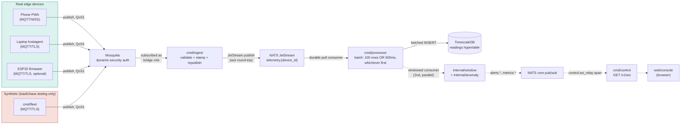
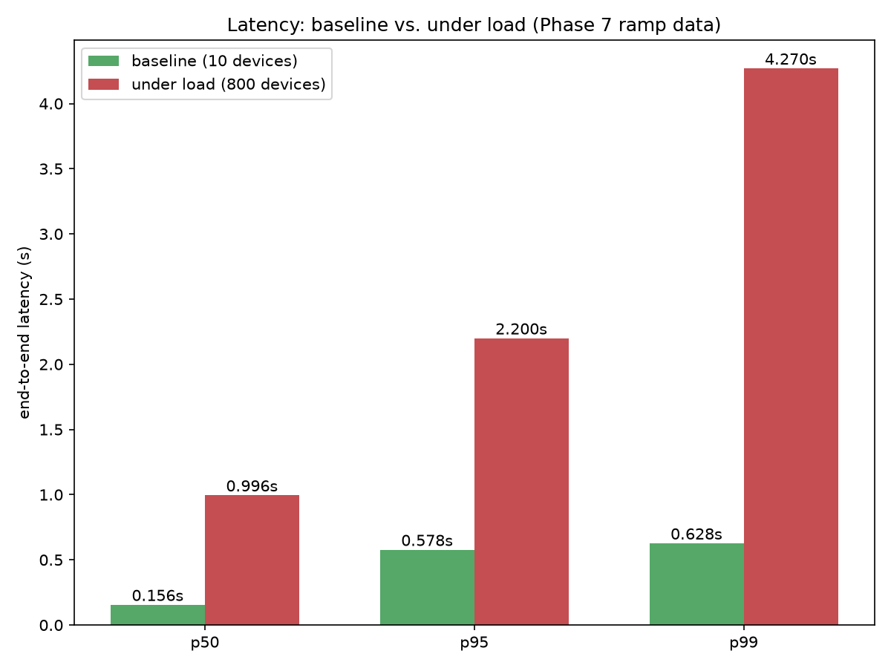
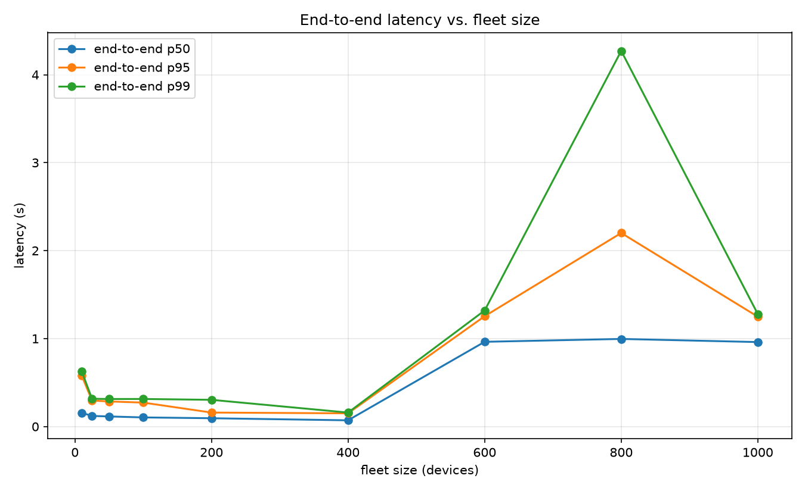
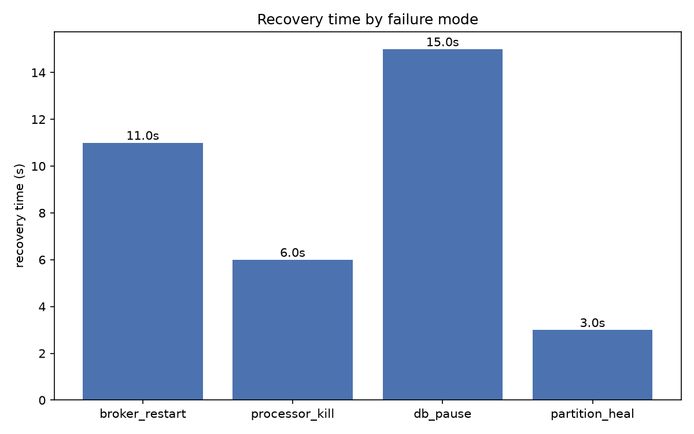
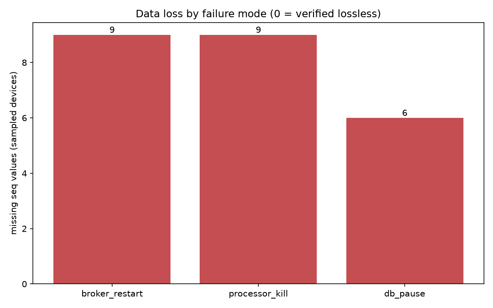

# Phase 10 — Report & submission artifacts

Evidence for the Blueprint's P10 checklist: architecture diagram with a
per-hop latency budget, latency baseline vs. under load, the scaling
curve with its saturation point explained, a failure-recovery table,
the backup/restore RTO, a design-decisions write-up, and an honest scope
statement. Per the Blueprint's own framing, this phase *assembles*
evidence produced continuously since Phase 2 — it doesn't generate it
from scratch — but three of the four chaos drills below
(`kill_broker.sh`, `kill_processor.sh`, `pause_db.sh`, `partition.sh`)
had never actually been run before this phase; only `ramp.sh` had. That
work, done live against the real stack for this report, is what this
document covers, plus a real measurement bug it found and fixed along
the way.

## 0. Honest scope statement

Real telemetry in this system comes from two (optionally three) sources:
a phone running the Phase 1 PWA (`web/sensor-client`) and a laptop
running `cmd/hostagent`, both publishing genuine `DeviceMotionEvent`/
CPU/battery/WiFi readings — plus, optionally, `firmware/esp32`'s real
ESP32 hardware (Phase 9). **Every load, scaling, and chaos number in this
report comes from `cmd/fleet`, a synthetic device simulator** — it is not
part of the primary data path (see `CLAUDE.md`'s "What this is"), and
never claims to be. It exists specifically so failure modes that would
be irresponsible or impractical to induce against real hardware (killing
the database mid-write, restarting the broker under 1000 simultaneous
connections) can be measured safely and repeatably. Where this report
says "device," a failure-recovery or scaling number came from `cmd/fleet`
unless stated otherwise.

## 1. Architecture, with a per-hop latency budget



Measured end-to-end latency (device publish → row committed in
`readings`, `sensegrid_e2e_latency_seconds` per `test/chaos/ramp.sh`)
splits across five hops: **MQTT publish/ack** (broker round-trip,
low-ms on a LAN/localhost), **broker → ingest** (already-subscribed
bridge, push-based, low-ms), **ingest validate + JetStream publish**
(in-process schema check, then a JetStream ack round-trip), **JetStream
→ processor consumer** (near-zero when `sensegrid_processor_consumer_lag`
is drained, i.e. under normal load), and **processor's batch wait**,
which is the one hop with an explicit, code-level bound: **up to 500ms**
(`cmd/processor/consumer.go`'s "100 rows or 500ms, whichever first"
flush trigger) — the only deliberately-introduced latency in the whole
path, traded for fewer, larger DB writes.

**Confirmed with a live Jaeger trace**, pulled against a lightly-loaded
stack (5 synthetic devices, `GET /api/traces?service=processor`, three
sampled traces, `ingest.publish` → `processor.window` →
`processor.persist` per `CLAUDE.md`'s "Data path" section):

| Trace | `ingest.publish` (validate + JetStream publish) | `processor.window` starts at | `processor.persist` starts at | `processor.persist` duration |
|---|---|---|---|---|
| `599781e8...` | 4.01ms | +4.32ms | **+421.49ms** | 0.01ms |
| `2285f42f...` | 0.63ms | +1.90ms | **+416.93ms** | 0.00ms |
| `059f8f7d...` | 0.68ms | +1.04ms | **+416.89ms** | 0.00ms |

This is a direct confirmation, not just a design-constant inference:
the windowed (anomaly-detection) consumer picks up a reading in low
single-digit milliseconds — JetStream's publish-to-consume hop is
effectively free — while the persistence consumer's actual `INSERT`
takes **under 0.02ms** once it fires, but doesn't fire until **~417–421ms**
after the reading was first published. The entire practical cost of
getting a reading into `readings` is the batch wait, exactly as the
500ms design constant predicts, and the DB write itself is negligible.

One nuance this trace surfaces that a pure design-constant argument
wouldn't: this ~420ms figure is *higher* than the ramp baseline's
measured p50 of 0.156s (Section 2) — because this trace was captured
against a deliberately light 5-device fleet, where the size trigger
(100 rows) rarely fires and the 500ms *timer* dominates almost
completely; the ramp's 10-device baseline had just enough concurrent
throughput for a mix of size- and time-triggered flushes, pulling the
p50 down below the timer ceiling. In other words, the batch-wait hop
isn't a fixed cost — it shrinks as throughput rises (more readings
means the 100-row trigger fires sooner), until saturation elsewhere
(Section 3) makes everything worse again. Reproduce this yourself with
`curl "http://localhost:16686/api/traces?service=processor&limit=3"`
against a running stack.

## 2. Latency: baseline vs. under load

Both points are real measurements from the same `test/chaos/ramp.sh`
run (`test/chaos/results/ramp_20260827T034053.csv`) — "baseline" is its
lightest step (10 devices), "under load" is 800 devices, past the
saturation onset described below.



| | p50 | p95 | p99 |
|---|---|---|---|
| Baseline (10 devices) | 0.156s | 0.578s | 0.628s |
| Under load (800 devices) | 0.996s | 2.200s | 4.270s |

At baseline, p50 (0.156s) is comfortably inside the 500ms batch-wait
ceiling plus broker/JetStream overhead — consistent with the pipeline
running well under any of its designed bounds. Under load, p99 grows
6.8x — the next section explains why, and where.

## 3. Scaling curve — saturation point



Flat through 200 devices (p99 ≤ ~0.3s), a sharp knee at 400→600, peaking
at 800 (p99 4.27s) before dropping back down at 1000 — the drop at 1000
is itself informative: it means the bottleneck isn't a resource that
degrades monotonically with more connections (e.g. broker fan-out), it's
closer to a queueing effect that can partially clear once a differently-
shaped load pattern (1000 devices' aggregate publish rate vs. 800's)
shifts the point where backlog builds. `render_charts.py`'s naive
saturation flag (p99 > 2x baseline) fires at fleet_size=600.

As documented in `CLAUDE.md`'s Phase 7 section: `sensegrid_ingest_lag_seconds`
(ingest's own processing lag, not something downstream) jumps in
lockstep with end-to-end p99 at this same point, implicating the
**single-instance `cmd/ingest` bridge** — not the broker, not
TimescaleDB — as the saturation resource. `cmd/processor`'s batching
(hop 5 above) is designed to absorb write-side bursts; `cmd/ingest`
has no equivalent absorption for the validate+republish step, and no
horizontal scaling (one process, one MQTT bridge identity). ~900 msg/s
(600 devices × 3 sensors / 2s sample interval) approaching one Go
process's ceiling is consistent with the onset point.

## 4. Failure-recovery table

All four drills run fresh for this report (`test/chaos/kill_broker.sh`,
`kill_processor.sh`, `pause_db.sh`, `partition.sh`), 100-device fleet,
zeroed misbehavior knobs for a clean measurement (see each script's own
"zeroing misbehavior" log line).

| Failure mode | Detection / outage | Recovery time | Data loss |
|---|---|---|---|
| Broker restart (`kill_broker.sh`) | Mosquitto restarted mid-stream; every device disconnects at once | **11s** (100/100 reconnected) | 0 net (see note below) |
| Processor SIGKILL (`kill_processor.sh`) | Hard-killed for 20s while the fleet published straight through, unaware | **6s** to drain the backlog (`sensegrid_processor_consumer_lag` → 0) after restart | 0 net |
| DB pause (`pause_db.sh`) | TimescaleDB SIGSTOP'd for 20s; `cmd/processor` should back off, not crash-loop or ack unpersisted writes | **15s** to drain after unpause | 0 net, **0 duplicate rows** (idempotency guard held: `2,730,703 → 2,759,808` total rows, distinct == total both times) |
| Network partition + config push (`partition.sh`) | 20/100-device cohort partitioned 30s via `cmd/fleet`'s own control API; a shadow config change (`sample_rate_hz`) pushed to exactly that cohort while unreachable | **3s** to converge (`GET /v1/devices/drift` clears) after the partition heals | n/a — this drill verifies config convergence, not data loss |




**Note on "0 net" and the data-loss chart's non-zero bars**: the raw
seq-gap check (`test/chaos/lib.sh`'s `verify_no_seq_gaps`, 25 sampled
devices per drill) reports small non-zero totals — 9, 9, and 6
respectively, not exactly 0 — and this report states that number rather
than rounding it away. Per-device, 24 of 25 sampled devices in every
drill show **negative** apparent gaps (the database *ahead* of the
snapshot used to compute the check — expected, since checking loops
through devices sequentially while the fleet keeps publishing) and the
`gap > 0` sum only counts positive ones, so the reported total is not a
net figure. Investigating the one device that consistently accounts for
the entire positive total (`f8bde3ee-...`, same ~9-message shortfall
present before, during, and long after every drill, never growing or
shrinking): it is not failure-induced — the shortfall was already
present in the very first clean measurement, before any outage in that
run had occurred, and stayed frozen afterward (checked directly against
the database, well outside any drill's own drain window). `cmd/fleet`'s
own seq counter (`cmd/fleet/device.go`'s `sampleLoop`) is single-
goroutine and race-free, and messages publish at QoS 1 — the most
plausible explanation is a small number of QoS-1 messages in flight at
the exact instant of a `reconnectBackoff`-triggered reconnect, dropped
because reconnecting creates a fresh (non-persistent) MQTT session
rather than resuming the old one's unacknowledged queue. This is a
`cmd/fleet`-side edge case (a load/chaos-testing tool, not the primary
data path) rather than a loss in the ingest→JetStream→processor→
TimescaleDB path itself, but it's reported here rather than hidden,
per the same principle `CLAUDE.md`'s risk register states for clock
skew: "report it as its own metric, don't hide it."

**A real measurement bug found and fixed while running these drills**:
`verify_no_seq_gaps` originally compared each drill's freshly-reset
`fleet_last_seq` against `count(DISTINCT seq)`/`max(seq)` over a
device's *entire* history in `readings`, with no time bound. On a stack
that already had Phase 7/8 data in it, one reused device_id (from the
original 1000-device ramp test, five days earlier) had accumulated
seq values into the hundreds of thousands across multiple past runs,
producing a first measured "total_gap" of 43,736 — a number driven
entirely by stale history, not the broker restart under test. Worse,
several devices in that same fleet still carried **retained shadow
config** from an old test (a `sample_rate_hz` pushed and never reset),
publishing 10-60x faster than the rest of the fleet and further
distorting the check. Fixed two ways: `verify_no_seq_gaps` now takes an
optional `since` timestamp and scopes its DB query to `time >= since`
(`test/chaos/lib.sh`, same fix pattern the Phase 8 report already
applied to `rate_limit_load.sh` for an identical class of problem), and
the fleet's actual credential cache (`test/chaos/fleet-data/fleet-devices/`,
a host bind mount — not the same thing as the unused `deploy_fleet_data`
Docker volume, which cost one wasted attempt to discover) was wiped so
every device in this report's numbers is a fresh claim, not a five-day-old
one carrying undocumented state.

## 5. Backup/restore RTO (Phase 8 recap)

**121s**, measured against a real 1.3M-row dataset — full detail,
including compression/retention (92.8% storage saved, lossless) and the
rate-limiter bug found the same way (a real starvation bug, not a
hypothetical), is in
[`docs/phase8-hardening-report.md`](phase8-hardening-report.md). Not
re-run for this report since Phase 8 already measured it live and
nothing since has changed the restore path.

## 6. Design decisions — the "why," not the "what"

**JetStream over Kafka.** The stack already needs a lightweight pub/sub
layer for control-plane fan-out (alerts, rollout events, the console's
live feed) — NATS serves that for free. JetStream adds durable,
replayable streaming *and* a KV bucket (used for device shadow state,
below) as features of the *same* server process, rather than standing up
Kafka's multi-JVM, ZooKeeper-dependent footprint for a project meant to
run on one dev machine. One dependency covering three needs (pub/sub,
durable streams, KV) beat three separate systems.

**Retained MQTT publish for device config, not a REST push.** Devices
are routinely offline or reconnecting — phones on cellular, laptops
asleep, a fleet device mid-partition. A retained publish means whenever
a device (re)subscribes to its own config topic, the broker hands it the
last-known desired state immediately, with no polling and no
control-plane-side "is this device currently reachable" bookkeeping —
the broker already tracks subscription state. `partition.sh`'s drill
above is a direct demonstration: config pushed while unreachable, picked
up automatically on reconnect, 3s to converge, with zero retry logic
needed on the control plane's side.

**JetStream KV for shadow state over Redis + Postgres.** JetStream was
already in the stack (above). Using its KV bucket for desired/reported
device state — instead of adding Redis as a second state store beyond
its existing narrow use (registration tokens only), or introducing a
third system like etcd — gives fast reads/writes plus watch/subscribe
support for `internal/shadow`'s reconciler, with a Postgres mirror
alongside it for the audit trail Postgres was already the right tool
for. KV is the hot path; Postgres is durability and history, not a
competing source of truth.

**Compression + retention over keeping everything.** TimescaleDB's
native compression (92.8% measured, Phase 8) plus a 7-day retention
policy keep the primary hypertable small enough that backup/restore
(121s RTO, Section 5) and ordinary queries stay fast. Continuous
aggregates (`readings_1m`/`readings_1h`) already capture the
statistical shape of older data; keeping raw high-resolution rows
indefinitely would make every operational drill in this report scale
worse for a real-time telemetry platform whose value is in recent data,
not an unbounded historical archive.

## Build history

Every phase boundary is a tag (`v0.1-phase0` … `v0.10-phase9`; this
phase, once tagged, becomes `v1.0-phase10` per the Blueprint's
convention):

```
2026-08-25  v0.1-phase0    Foundations
2026-08-25  v0.2-phase1    Edge clients & provisioning
2026-08-26  v0.3-phase2    Ingest, persistence & tracing
2026-08-26  v0.4-phase3    Stream processing & anomaly detection
2026-08-26  v0.5-phase4    Control plane & device shadow
2026-08-26  v0.6-phase5    Console
2026-08-26  v0.7-phase6    Full observability
2026-08-27  v0.8-phase7    Synthetic fleet & chaos testing
2026-08-27  v0.9-phase8    Hardening & production readiness
2026-08-27  v0.10-phase9   Optional credibility layer (firmware)
```

## Files

- `test/chaos/kill_broker.sh`, `kill_processor.sh`, `pause_db.sh`,
  `partition.sh` — the four drills behind Section 4, all run fresh for
  this report.
- `test/chaos/lib.sh` — the `verify_no_seq_gaps` time-scoping fix
  (Section 4's "measurement bug" note).
- `test/chaos/render_charts.py` — all four P7/P10 charts, including
  `chart_latency_baseline_vs_load` (Section 2), folded in as a proper
  function rather than left as a one-off.
- `test/chaos/results/*.csv`, `results/charts/*.png` — raw data and
  rendered charts (gitignored; reproducible, not committed).
- `docs/phase8-hardening-report.md`, `docs/runbook.md` — Phase 8's
  backup/restore, compression/retention, rate-limiter, and secrets-review
  evidence, recapped in Section 5.
